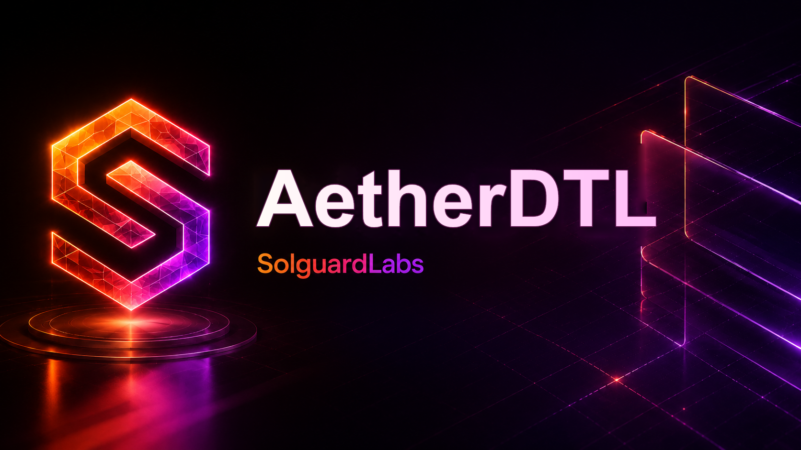

# AetherDTL



AetherDTL es una red local de intents economicos escrita en C++20. El sistema
modela usuarios que firman intenciones abstractas, operadores autorizados que
construyen planes concretos de ejecucion y un motor de settlement que valida
precios, expiracion, fills parciales, fees y cancelaciones.

El binario no requiere servicios externos. Los tests TypeScript ejecutan la CLI
con escenarios deterministas y validan el contrato JSON emitido por el motor.

## Componentes

- `src/aether.hpp`: tipos publicos del motor, ledger, intents, rutas y reportes.
- `src/core.cpp`: amounts, hashes estables, canonicalizacion y helpers JSON.
- `src/ledger.cpp`: cuentas, activos, lanes, balances y journal de eventos.
- `src/intent.cpp`: intents firmados, planes, signatures y libro de intents.
- `src/matcher.cpp`: controles locales de matching y precio.
- `src/engine.cpp`: lifecycle de intents y ejecucion de planes.
- `src/audit.cpp`: reconciliacion, lineas de riesgo y catalogo de rutas.
- `src/policy.cpp`: ventanas temporales y proyecciones de fills.
- `src/score.cpp`: score operativo de operadores.
- `src/scenarios.cpp`: escenarios deterministas de auditoria.
- `src/report.cpp`: serializacion JSON estable para tooling externo.

## Requisitos

- Node.js 24 o superior.
- Un compilador C++20 disponible como `c++`, `g++`, `clang++` o MSVC Build Tools.

En Windows, el script de build intenta detectar Visual Studio Build Tools y
ejecutar `vcvars64.bat` automaticamente.

## Uso

Compilar:

```bash
npm run build
```

Listar escenarios:

```bash
build/aetherdtl --list
```

Ejecutar un escenario:

```bash
build/aetherdtl scenario baseline
```

## Tests

```bash
npm test
```

La suite compila el binario y ejecuta:

```bash
node --test "tests/node/*.test.ts"
```

Los escenarios publicos cubren:

- emision y verificacion de intents firmados;
- expiracion y cancelacion;
- controles de matching;
- ejecucion parcial;
- rotacion de operadores autorizados.

## CI

El workflow de GitHub Actions instala Node.js 24, un compilador C++ y ejecuta:

```bash
bash scripts/ci.sh
```

## Estado Del Lab

AetherDTL esta disenado como un repositorio autocontenido de revision tecnica.
La salida JSON de la CLI es el contrato principal para tests y herramientas de
auditoria.
