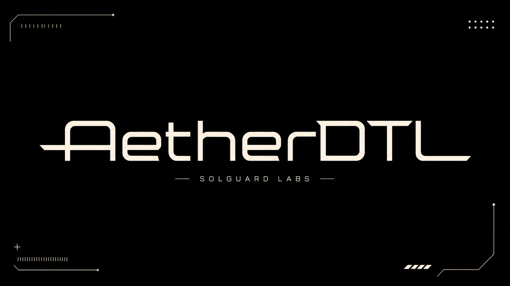
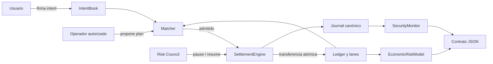
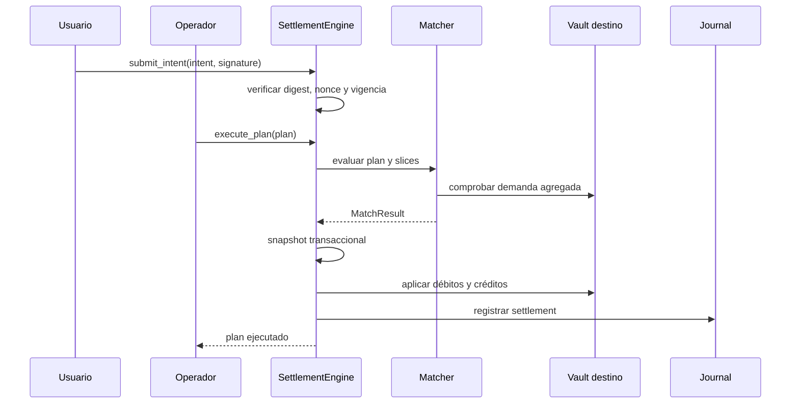
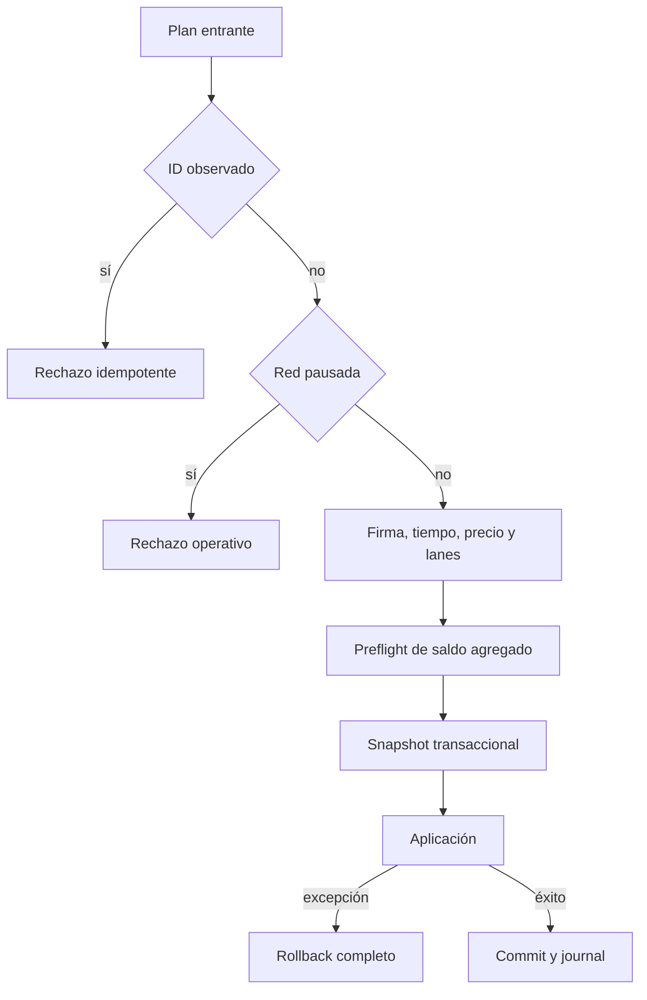

# AetherDTL

[](https://github.com/SolguardLabs/AetherDTL/actions/workflows/ci.yml)
[](https://github.com/SolguardLabs/AetherDTL/releases/tag/v1.0.0)
[](https://isocpp.org/)
[](https://nodejs.org/)
[](./LICENSE)

AetherDTL es una red de liquidación de intents económicos. Los usuarios firman límites y
condiciones de ejecución; los operadores autorizados construyen planes fragmentados sobre lanes
de liquidez; el motor valida firma, vigencia, precio, inventario, comisiones y estado operativo
antes de aplicar cada movimiento contable.

El núcleo está escrito en C++20 y expone una CLI determinista en JSON. TypeScript verifica el
contrato de integración y los escenarios operativos de extremo a extremo.

## Capacidades

- Intents firmados con nonce, ventana temporal, límite de origen y mínimo de destino.
- Matching por slices con políticas independientes por lane.
- Liquidación atómica con preflight agregado de inventario del vault.
- Idempotencia por identificador de plan y journal canónico de eventos.
- Pausa de emergencia gobernada por una cuenta `guardian`.
- Conciliación de cuentas, lanes, operadores, intents y exposiciones.
- Modelo de reserva bajo shocks de precio, liquidez, correlación y concentración.
- Señales operativas de cobertura, concentración, rechazos y suelo de reservas.
- CI reproducible con warnings tratados como error, ASan y UBSan.

## Arquitectura


```mermaid
flowchart LR
    U["Usuario"] -->|"firma intent"| B["IntentBook"]
    O["Operador autorizado"] -->|"propone plan"| M["Matcher"]
    B --> M
    L["Ledger y lanes"] --> M
    M -->|"admitido"| E["SettlementEngine"]
    G["Risk Council"] -->|"pause / resume"| E
    E -->|"transferencia atómica"| L
    E --> J["Journal canónico"]
    L --> R["EconomicRiskModel"]
    J --> S["SecurityMonitor"]
    R --> API["Contrato JSON"]
    S --> API
```

La separación entre admisión, mutación y observabilidad evita que el reporting sea una fuente de
verdad contable. El `Ledger` conserva los saldos; el `Journal` registra la secuencia; los modelos
de riesgo derivan vistas reproducibles sin escribir estado.

## Flujo De Liquidación


```mermaid
sequenceDiagram
    participant Owner as Usuario
    participant Operator as Operador
    participant Engine as SettlementEngine
    participant Matcher
    participant Vault as Vault destino
    participant Journal

    Owner->>Engine: submit_intent(intent, signature)
    Engine->>Engine: verificar digest, nonce y vigencia
    Operator->>Engine: execute_plan(plan)
    Engine->>Matcher: evaluar plan y slices
    Matcher->>Vault: comprobar demanda agregada
    Matcher-->>Engine: MatchResult
    Engine->>Engine: snapshot transaccional
    Engine->>Vault: aplicar débitos y créditos
    Engine->>Journal: registrar settlement
    Engine-->>Operator: plan ejecutado
```

## Modelo Económico

Para cada celda de liquidación `i`, el motor deriva una pérdida estresada:

```text
L_i = N_source,i × (s_source + d_operator)
    + N_target,i × (s_target + h_liquidity)
```

La cola correlacionada usa un modelo de factor común:

```text
L_corr = √((1 - ρ) × Σ L_i² + ρ × (Σ L_i)²)
```

La reserva requerida incorpora concentración y operación:

```text
R_required = L_corr + C_largest + B_operational
coverage_bps = R_available × 10,000 / R_required
```

Los parámetros por defecto y un ejemplo numérico completo están en
[docs/economic-model.md](./docs/economic-model.md).

## Controles De Seguridad


```mermaid
flowchart TD
    P["Plan entrante"] --> I{"ID observado"}
    I -->|"sí"| R1["Rechazo idempotente"]
    I -->|"no"| PA{"Red pausada"}
    PA -->|"sí"| R2["Rechazo operativo"]
    PA -->|"no"| V["Firma, tiempo, precio y lanes"]
    V --> Q["Preflight de saldo agregado"]
    Q --> T["Snapshot transaccional"]
    T --> A["Aplicación"]
    A -->|"excepción"| RB["Rollback completo"]
    A -->|"éxito"| C["Commit y journal"]
```

La política completa, los límites de confianza y la respuesta operativa están descritos en
[SECURITY.md](./SECURITY.md) y [docs/security-model.md](./docs/security-model.md).

## Contrato JSON

```json
{
  "protocol": "AetherDTL",
  "network_id": "aether-intentnet-1",
  "scenario": "baseline",
  "state_digest": "…",
  "risk": {
    "executed_plans": 1,
    "visible_source_used": 500000000
  },
  "economic_risk": {
    "required_reserve": 371190040,
    "coverage_bps": 627506,
    "solvent": true
  },
  "security": {
    "paused": false,
    "healthy": false,
    "signals": [
      { "kind": "operator_concentration", "observed": 10000, "unit": "bps" },
      { "kind": "lane_concentration", "observed": 10000, "unit": "bps" }
    ]
  }
}
```

Los importes son enteros en la precisión del activo. Los ratios se expresan en basis points y los
digests se serializan en hexadecimal minúsculo.

## Inicio Rápido

Requisitos:

- Node.js 24.
- npm 11.
- Compilador C++20: GCC, Clang o Visual Studio Build Tools.

```bash
npm ci
npm test
build/aetherdtl --list
build/aetherdtl scenario baseline
```

En PowerShell:

```powershell
npm.cmd ci
powershell.exe -NoProfile -ExecutionPolicy Bypass -File .\scripts\tests.ps1
```

El build detecta MSVC mediante `vswhere` cuando `cl.exe` todavía no está cargado en la sesión.

## Puertas De Calidad

```bash
bash scripts/ci.sh
```

La puerta ejecuta instalación congelada, Prettier, compilación C++ con `-Werror`, tests Node,
smoke de todos los escenarios y mínimo de LoC. GitHub Actions añade una compilación independiente
con AddressSanitizer y UndefinedBehaviorSanitizer.

## Documentación

- [Índice técnico](./docs/README.md)
- [Arquitectura](./docs/architecture.md)
- [Intents y firmas](./docs/intents-and-signatures.md)
- [Liquidación y liquidez](./docs/settlement-and-liquidity.md)
- [Modelo económico](./docs/economic-model.md)
- [Modelo de seguridad](./docs/security-model.md)
- [Operaciones](./docs/operations.md)
- [Integración](./docs/integration.md)

## Distribución

| Referencia   | Uso                                     |
| ------------ | --------------------------------------- |
| `main`       | historial integrado y verificable       |
| `production` | commit exacto aprobado para operación   |
| `v1.0.0`     | artefacto inmutable de Production 1.0.0 |

Consulta [CHANGELOG.md](./CHANGELOG.md) para cambios de versión y
[CONTRIBUTING.md](./CONTRIBUTING.md) para el flujo de colaboración.
