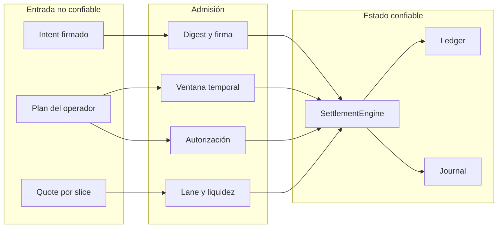
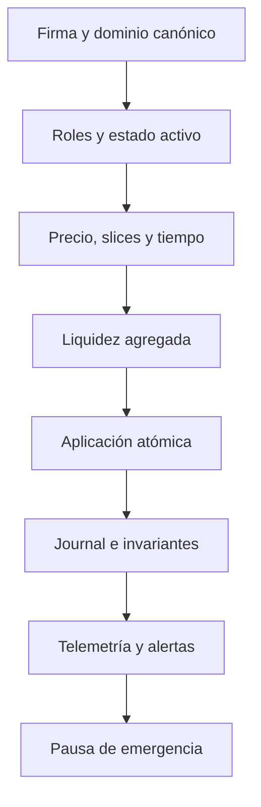

# Política De Seguridad

## Versiones Mantenidas

| Versión | Estado            |
| ------- | ----------------- |
| 1.0.x   | Mantenida         |
| < 1.0   | Sin mantenimiento |

La referencia operativa es el commit compartido por la rama `production` y el tag estable más
reciente.

## Comunicación Privada

No abras un issue público para una incidencia de seguridad. Utiliza **Security → Report a
security advisory** en GitHub y aporta:

- componente y versión observados;
- precondiciones y secuencia mínima;
- efecto contable o de disponibilidad;
- salida JSON y digest de estado;
- propuesta de test de regresión, si existe.

No incluyas secretos, claves privadas ni datos personales. La recepción se confirma en un máximo
de tres días laborables y la clasificación inicial se comunica dentro de siete días laborables.

## Límites De Confianza

Los operadores no controlan saldos, roles ni políticas de lane. El reporting deriva del estado
confirmado y nunca autoriza una transferencia.

## Invariantes

- Ningún saldo disponible o reservado puede ser negativo.
- Todo intent aceptado conserva una firma válida sobre su payload canónico.
- Todo plan referencia un intent conocido y su digest exacto.
- Un identificador de plan repetido solo puede terminar rechazado.
- Los débitos agregados de un vault se validan antes de la primera mutación.
- Una excepción durante settlement restaura ledger, intents y exposición.
- Las reservas de cada vault permanecen por encima del suelo configurado.
- Cancelación, expiración y pausa impiden nuevas ejecuciones.

## Defensa En Profundidad

El `SecurityMonitor` publica concentración por operador y lane, tasa de rechazo, cobertura de
reservas y estado de pausa. Las señales son observabilidad; las decisiones que mutan estado siguen
pasando por el motor.

## Operación De Emergencia

Solo una cuenta activa con rol `guardian` o `system` puede cambiar la pausa. Activarla exige una
razón no vacía y genera `pause_changed`. Durante la pausa, los planes quedan registrados como
rechazados sin tocar balances. La reanudación también queda en el journal.

Procedimiento:

1. detener admisión;
2. capturar `state_digest`, journal y snapshot de seguridad;
3. reconciliar saldos, reservas y planes;
4. corregir o aislar la causa;
5. ejecutar la suite completa y los sanitizers;
6. reanudar mediante un segundo evento del guardián.

## Cadena De Suministro

- Dependencias Node fijadas en `package-lock.json`.
- Instalación de CI mediante `npm ci`.
- Acciones oficiales de GitHub con permisos `contents: read`.
- Dependabot semanal para npm y GitHub Actions.
- Warnings C++ tratados como error.
- Ejecuciones independientes con ASan y UBSan.
- Verificación del tag contra la versión de `package.json`.

## Alcance

La política cubre `src/`, scripts de build, contrato JSON, tests y workflows. Problemas exclusivos
del sistema operativo, del compilador o de una integración externa deben acompañarse de evidencia
que muestre un efecto en AetherDTL.
