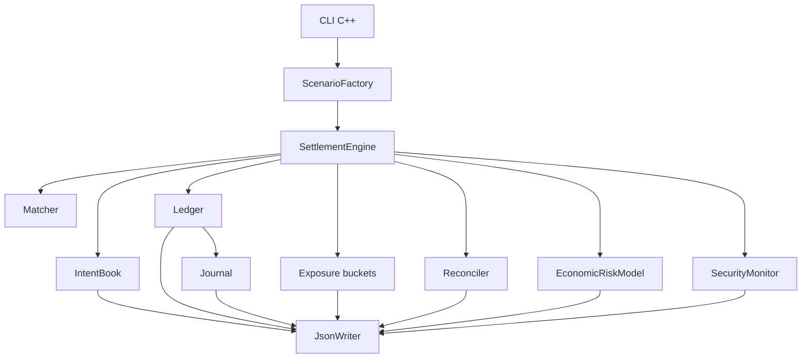
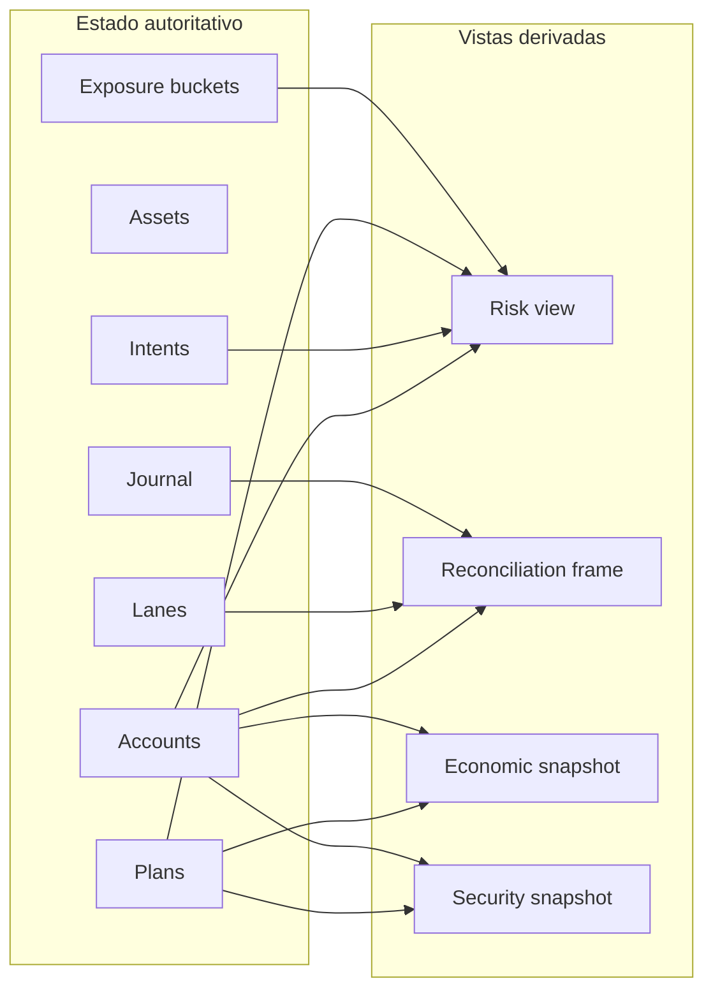

# Arquitectura

## Vista General

AetherDTL separa comandos, estado contable y vistas derivadas. La CLI selecciona un escenario y
serializa un snapshot; no contiene reglas económicas.

## Componentes

### SettlementEngine

Coordina tiempo, intents, planes y transición de estado. Sus responsabilidades son:

- expirar intents antes de admitir un plan;
- aplicar idempotencia por `plan.id`;
- respetar la pausa global;
- delegar validación estática y económica al `Matcher`;
- crear un snapshot antes de mutar;
- confirmar el plan o restaurar el snapshot completo.

### Ledger

Registra activos, cuentas, lanes, operadores y saldos. Todas las sumas y restas pasan por
`Amount`, que rechaza negativos, overflow y underflow.

### IntentBook

Conserva un único intent por ID. Los estados permitidos son `draft`, `open`, `filled`,
`cancelled` y `expired`.

### Matcher

Evalúa el plan sin mutar:

- identidad del operador;
- digest y estado del intent;
- antigüedad del plan;
- unicidad y límites de slices;
- compatibilidad de activos y lanes;
- floor de precio y target proporcional;
- balance del usuario;
- demanda agregada por vault y activo.

### Vistas Derivadas

`Reconciler`, `EconomicRiskModel` y `SecurityMonitor` reciben una referencia constante. Esto evita
que una consulta de reporting pueda modificar el ledger.

## Propiedad Del Estado

## Determinismo

Los mapas ordenados, el formato canónico length-prefixed y la serialización estable permiten que
el mismo estado produzca el mismo digest. El tiempo nunca se lee del sistema operativo: se avanza
de forma explícita mediante `set_time` o `advance_time`.

## Estructura Del Código

| Ruta                | Responsabilidad                         |
| ------------------- | --------------------------------------- |
| `src/aether.hpp`    | contrato de tipos y servicios           |
| `src/core.cpp`      | amounts, enums, hash y JSON helpers     |
| `src/intent.cpp`    | canonicalización, firmas e IntentBook   |
| `src/ledger.cpp`    | saldos, lanes, transferencias y journal |
| `src/matcher.cpp`   | admisión sin escritura                  |
| `src/engine.cpp`    | transición atómica y ciclo de vida      |
| `src/audit.cpp`     | conciliación y routing                  |
| `src/risk.cpp`      | capital económico estresado             |
| `src/security.cpp`  | señales operativas                      |
| `src/scenarios.cpp` | escenarios reproducibles                |
| `src/report.cpp`    | contrato JSON                           |
