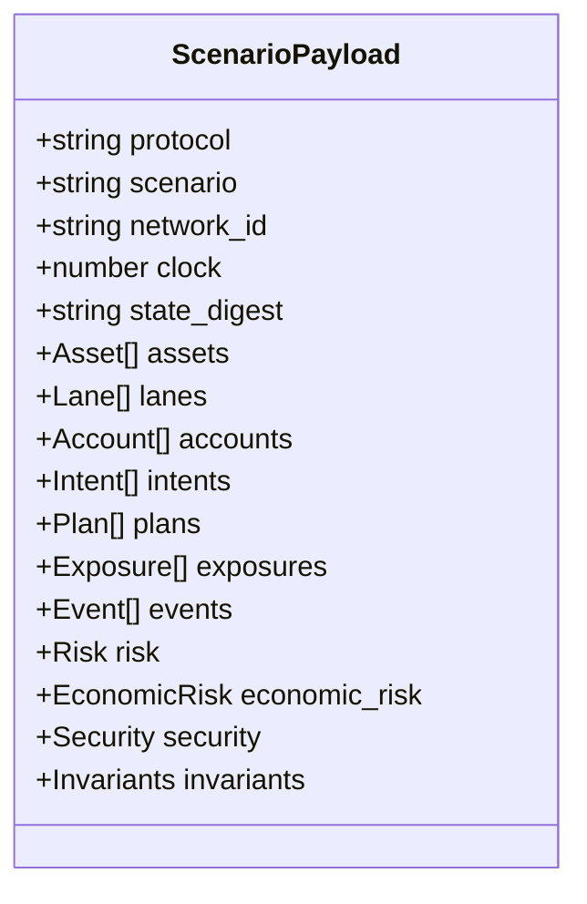

# Integración

## CLI

```text
aetherdtl --list
aetherdtl scenario <name>
aetherdtl <name>
```

Códigos de salida:

| Código | Significado                               |
| -----: | ----------------------------------------- |
|      0 | ejecución y serialización correctas       |
|      1 | escenario desconocido o excepción interna |
|      2 | falta el nombre del escenario             |

`stdout` contiene exclusivamente JSON cuando el comando de escenario termina correctamente.
Mensajes de ayuda y errores se separan de la salida de datos.

## Esquema Principal



## TypeScript

```ts
import { spawnSync } from "node:child_process";

const run = spawnSync("build/aetherdtl", ["scenario", "baseline"], {
  encoding: "utf8",
});
if (run.status !== 0) throw new Error(run.stderr);

const payload = JSON.parse(run.stdout);
if (payload.protocol !== "AetherDTL") throw new Error("unexpected protocol");
if (!Object.values(payload.invariants).every(Boolean)) {
  throw new Error("state invariants did not hold");
}
```

En Windows usa `build\\aetherdtl.exe`.

## Unidades

- Importes: enteros `int64` en precisión del activo.
- Precios: escala `1,000,000`.
- Ratios: basis points sobre `10,000`.
- Timestamps: enteros en segundos.
- Digest: 32 caracteres hexadecimales.

No conviertas importes a `number` si el consumidor puede superar `2^53 - 1`. Usa `bigint` o una
librería decimal y conserva el valor JSON original.

## Compatibilidad

Los campos existentes no cambian dentro de una versión minor. Nuevos campos pueden añadirse a
objetos. Los consumidores deben ignorar claves desconocidas y validar siempre `protocol`,
`network_id` e invariantes.

## Validación De Entrada

Un integrador debe:

1. comprobar código de salida;
2. parsear JSON una sola vez;
3. verificar protocolo y red;
4. verificar formato del digest;
5. rechazar invariantes negativas;
6. aplicar límites propios sobre señales y cobertura;
7. registrar digest y clock procesados.
