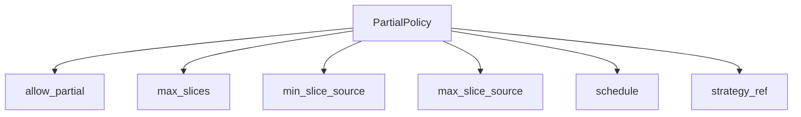
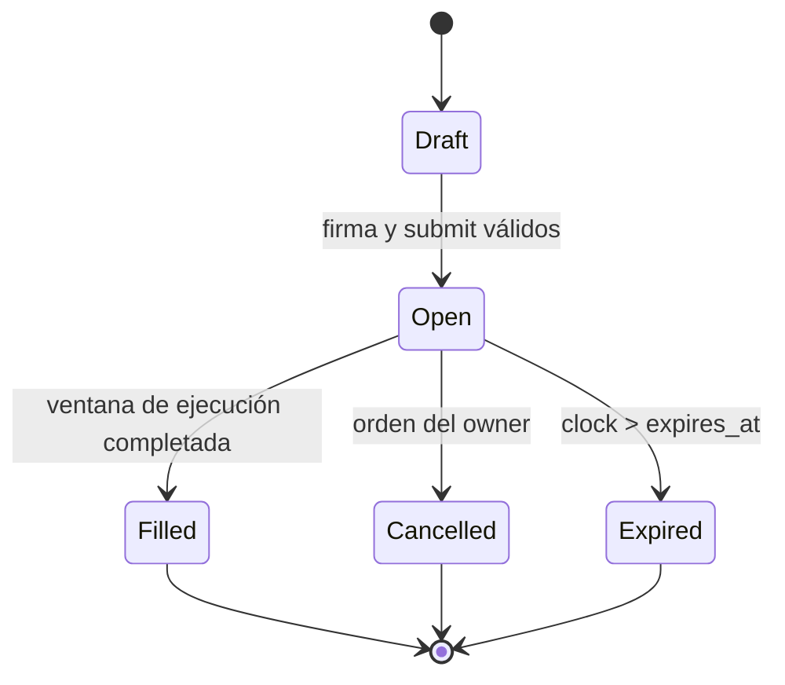

# Intents Y Firmas

## Payload Económico

Un `Intent` define:

| Campo                        | Significado                                |
| ---------------------------- | ------------------------------------------ |
| `owner`                      | cuenta que autoriza el movimiento          |
| `source_asset`               | activo debitado                            |
| `target_asset`               | activo recibido                            |
| `max_source`                 | máximo de origen del intent                |
| `min_target`                 | mínimo de destino para el nominal completo |
| `quote_floor_bps`            | calidad mínima respecto al oracle interno  |
| `valid_after` / `expires_at` | ventana de ejecución                       |
| `nonce`                      | orden lógico de autorización               |
| `partial`                    | política de fragmentación                  |

## Canonicalización

Cada campo se codifica como `longitud:valor`. La concatenación evita ambigüedades como
`["ab", "c"]` frente a `["a", "bc"]`.

```text
canonical = join_fields([
  "intent", id, owner, source_asset, target_asset,
  max_source, min_target, quote_floor_bps,
  valid_after, expires_at, nonce, partial_policy
])

digest = stable_hash(canonical)
signature = stable_hash("signature" | owner | secret | canonical)
```

El firmante registrado debe coincidir con `owner`; el digest del plan debe coincidir con el digest
almacenado en `IntentBook`.

## Política Parcial



`max_slices` limita los fragmentos dentro de un plan. Los floors y caps de slice se combinan con
el `max_fragment_source` de cada lane; se aplica siempre el límite más restrictivo.

## Ciclo De Vida



`set_time` llama a `expire_due` antes de cualquier ejecución. Un intent terminal no vuelve a
`open`.

## Ejemplo

```cpp
Intent intent;
intent.id = "intent-treasury-eur-2026-08";
intent.owner = "treasury-eu";
intent.source_asset = "aUSDC";
intent.target_asset = "aEUR";
intent.max_source = Amount::of(1'200'000'000);
intent.min_target = Amount::of(1'090'000'000);
intent.quote_floor_bps = 9'850;
intent.valid_after = 1'723'600'000;
intent.expires_at = 1'723'603'600;
intent.nonce = 42;
```

Tras firmar, cualquier cambio en los campos canónicos produce un digest distinto y el submit se
rechaza.
