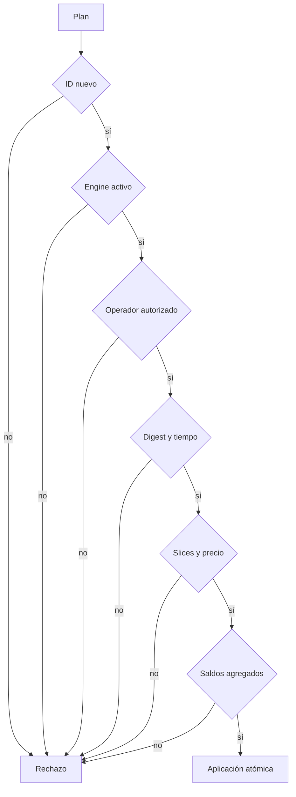
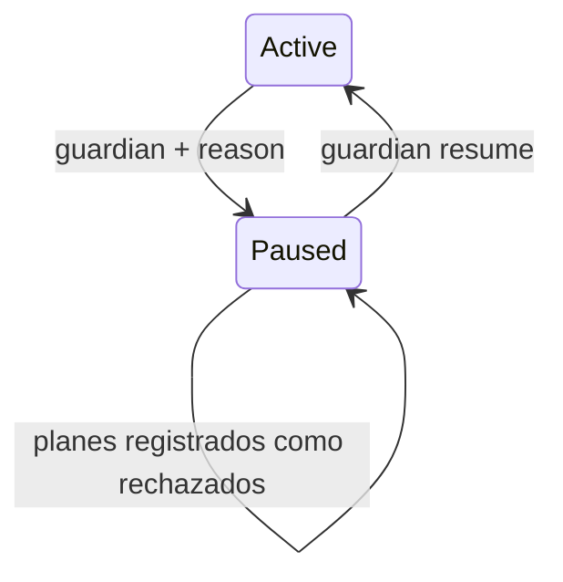

# Modelo De Seguridad

## Roles

| Rol             | Capacidad                              |
| --------------- | -------------------------------------- |
| `user`          | firma intents y recibe settlement      |
| `operator`      | propone planes sobre lanes autorizadas |
| `vault`         | mantiene inventario de liquidación     |
| `fee_collector` | recibe la comisión de protocolo        |
| `guardian`      | pausa y reanuda admisión               |
| `system`        | autoridad operativa de último recurso  |

Registrar una cuenta no la autoriza como operador. `Ledger::authorize_operator` mantiene una lista
separada y el matcher exige ambas condiciones.

## Capas De Admisión



## SecurityMonitor

El monitor calcula:

```text
operator_concentration = max(source por operador) / source ejecutado
lane_concentration = max(source por lane) / source ejecutado
rejection_rate = planes rechazados / planes observados
reserve_coverage = reservas normalizadas / source ejecutado
```

Límites por defecto:

| Señal                        | Límite |
| ---------------------------- | -----: |
| concentración por operador   |   75 % |
| concentración por lane       |   85 % |
| tasa de rechazo              |   50 % |
| cobertura mínima de reservas |  125 % |

También se emiten señales críticas cuando un vault cae bajo su `reserve_floor` o la red está
pausada.

## Pausa De Emergencia



La activación exige una razón. Los dos cambios generan `pause_changed` y forman parte del digest
del engine.

## Invariantes Publicadas

- `ledger_non_negative`
- `signatures_valid`
- `plans_have_intents`
- `local_limits_hold`
- `lifecycle_consistent`
- `replays_rejected`
- `vault_floors_hold`
- `reconciliation_consistent`

Un consumidor debe rechazar un snapshot si cualquiera es `false`, aunque el proceso haya devuelto
código cero.

## Rollback

Antes de mutar se copian ledger, IntentBook y buckets de exposición. Una excepción restaura las
tres estructuras y el journal anterior, y solo entonces registra `atomic_execution` como rechazo.
Esto mantiene alineados saldos, eventos y estado del intent.
