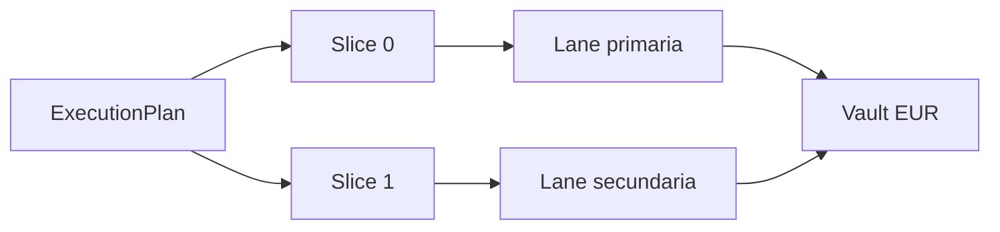
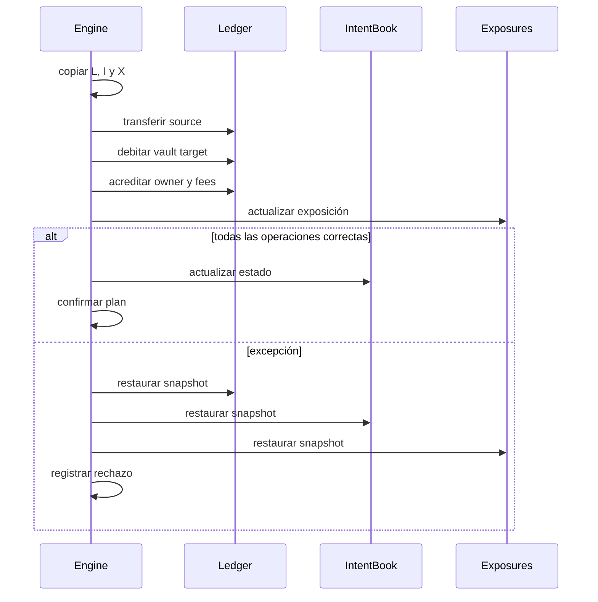

# Liquidación Y Liquidez

## Planes Y Slices

Un `ExecutionPlan` identifica operador, intent, estrategia operativa y uno o más `FillSlice`. Cada
slice selecciona una lane y declara origen, destino cotizado, ordinal y rebate.



## Precio

El ledger calcula:

```text
expected_target = source × price_source / price_target
oracle_floor = expected_target × quote_floor_bps / 10,000
slice_floor = expected_target × slice.price_bps / 10,000
required_target = max(oracle_floor, slice_floor)
```

El `quoted_target` debe ser igual o superior a `required_target`. Para el plan completo también se
prorratea `min_target` según `gross_source / max_source`.

## Comisiones

Por slice:

```text
operator_fee = quoted_target × operator_fee_bps / 10,000
protocol_fee = quoted_target × protocol_fee_bps / 10,000
rebate       = quoted_target × rebate_bps / 10,000
net_owner    = quoted_target - operator_fee - protocol_fee - rebate
```

El rebate se acredita de nuevo al owner y conserva un evento separado para conciliación.

## Preflight Agregado

Antes de escribir se agrupa la demanda por `(settlement_vault, target_asset)`:

```text
required[vault, asset] = Σ quoted_target de todos los slices compatibles
```

Cada agregado debe ser menor o igual al saldo disponible. Esta comprobación evita aprobar dos
slices que individualmente caben en el vault pero conjuntamente lo superan.

## Aplicación Atómica



La operación se considera confirmada solo después de aplicar todos los slices. El journal del
snapshot parcial también se descarta durante el rollback.

## Idempotencia

`plan.id` es una clave estable. Si ya aparece en el historial, cualquier nueva entrega queda
rechazada con `plan_duplicate`, incluso si cambia el timestamp.
